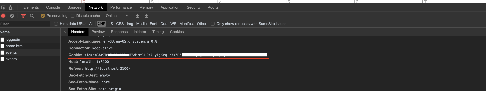
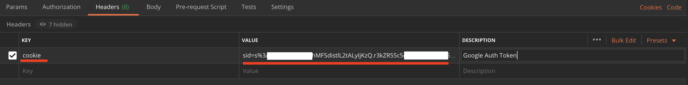

# Postman Hiring Challenge

## App Domain URI: <http://www.gcalendar.tk:3200/>

System Requirements: Node 8.x+

To access the API:

- Once user is logged-in, copy the header `cookie` from the browser and paste it into postman APIs.

Features:

1. Have implemented secure oauth login with Google.
2. User can view current month Google calendar events.
3. For each logged-in user, user will be able to add/update their available time slots.
4. Attende can schedule the event with Organizer.
5. All the APIs are securly oauth protected and data sharing between the Front-End and Back-End is in JSON.
6. Code is very modular, following the standard pratices with basic documentaion.

Technology:

- Express
- MongoDB
- Google Calender API

Known Issues:

- Manual process of copying the cookie from Browser to Postman
- Cannot delete available timeslot.
- UI not completely implemented.
- Not well-tested.

Please feel free to contact me for any queries.

Deepika Azad
azaddeepika05@gmail.com
+91 9783839582
